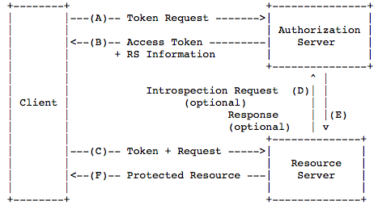
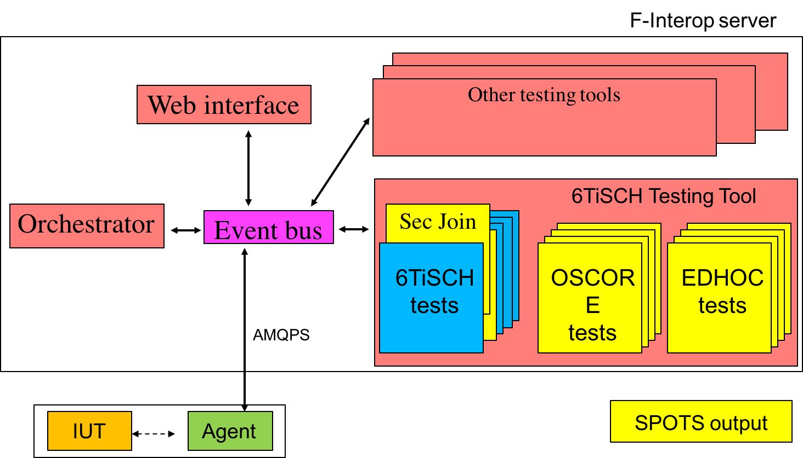
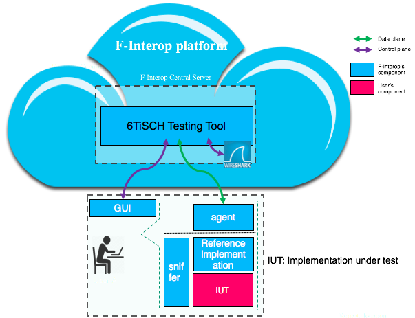

# Test Description of OSCORE profile of ACE framework

[//]: # (use Pandoc : pandoc spec.md -o spec.html)

## Table of Contents
0. [Glossary](#glossary)
1. [Introduction](#intro)
2. [Overview of ACE Framework](#ace)
3. [Testing with F-Interop Platform](#finterop)
4. [The Test Description Proforma](#proforma)
5. [Conventions](#conventions)
6. [Test Configuration](#config)
    1. [Implementation Under Test](#iut)
    2. [System Under Test](#sut)
    3. [F-Interop-specific Config](#finterop-config)
    4. [Security Context A](#context-as-c)
    5. [Security Context B](#context-as-rs)
    6. [Resources](#resources)
7. [Discovery Tests](#tests-discovery)
    1. [Test 1](#test-1)
8. [Correct Use Tests](#tests-correct)
    1. [Test 2](#test-2)
    2. [Test 3](#test-3)
    3. [Test 4](#test-4)
9. [Incorrect Use Tests](#tests-incorrect)
    1. [Test 5](#test-5)
    2. [Test 6](#test-6)

## Glossary {#glossary}

* ACE framework: Authentication and Authorization for Constrained Environments (ACE). See [Overview](#ace).
* OSCORE profile of ACE:  OSCORE profile of the Authentication and Authorization for Constrained Environments Framework. See [Overview](#ace).
* OSCORE: Object Security for Constrained RESTful Environments. See [draft-ietf-core-object-security-12](https://tools.ietf.org/html/draft-ietf-core-object-security-12).
* OAuth 2.0: The OAuth 2.0 Authorization Framework. See [RFC6749](https://tools.ietf.org/html/rfc6749).
* Stimulus: Type of a test step. See [The Test Description Proforma](#proforma).
* Configure: Type of a test step. See [The Test Description Proforma](#proforma).
* Check: Type of a test step. See [The Test Description Proforma](#proforma).
* IUT: Implementation Under Test. See [Test Configuration](#config).
* SUT: System Under Test. See [Test Configuration](#config).

## 1. Introduction {#intro}

This test description (TD) facilitates automated, remote testing of [OSCORE profile of ACE](https://tools.ietf.org/html/draft-ietf-ace-oscore-profile-01) as enabled by the [SPOTS](http://spots.ac.me) and [F-Interop](http://www.f-interop.eu) projects.

The TD follows the structure used for previous OSCORE interop events.
Test cases are designed to enable automated test execution based on F-Interop 6TiSCH testing tool and Wireshark.

University of Montenegro reserves the right to update the TD as tests are implemented in the F-Interop 6TiSCH testing tool. 
An up to date version of the TD can be found at: [https://github.com/malishav/TD-ACE-OSCORE](https://github.com/malishav/TD-ACE-OSCORE).

## 2. Overview of the ACE Framework and its OSCORE Profile {#ace}

The ACE framework enables authentication and authorization in constrained environments based on the re-use of OAuth 2.0 protocol flow.
The OAuth 2.0 architecture assumes the presence of 3 entities:

* Resource Server (RS), who offers a protected resource.
* Client (C), who is interested in accessing a protected resource.
* Authorization Server (AS), who mediates the exchange between C and RS and enforces the authorization decisions by handing out the access token.

OAuth 2.0 assumes a secure communication channel between the RS and the AS, as well as between the C and AS.
The configuration parameters needed to establish the secure channels is considered out-of-scope.
The tokens that the AS returns to the Client can be used to establish dynamically the secure channel between the C and RS, and they also contain the authorization information enabling the client to obtain a scoped access to a resource hosted on the RS.

The OAuth 2.0 flow is illustrated in the following figure.

The ACE framework allows different communication security mechanisms to be used for providing a secure channel, as well as different web transfer protocols.
This includes protocols such as TLS, DTLS, and OSCORE for providing a secure channel, and HTTP or CoAP for web transfer.
These bindings of the ACE framework with specific protocols are defined in ACE profiles.
This TD focuses on the [OSCORE profile of ACE](https://tools.ietf.org/html/draft-ietf-ace-oscore-profile-02), that specifies the use of CoAP for web transfer and OSCORE for communication security..

Object Security for Constrained RESTful Environments (OSCORE) is a mechanism to secure Constrained Application Protocol (CoAP).
Its distinguishing feature is that it provides end-to-end security in all scenarios where CoAP can be used, including communication through CoAP proxies, CoAP-to-HTTP proxies, and group communication (specified in a companion document).
Note how this contrasts (D)TLS-secured CoAP that only supports basic client-server exchanges with no intermediary proxies.

OSCORE assumes the existence of a security context shared between the two entities that wish to communicate securely.
How this context is established is considered out-of-scope.
The OSCORE profile of ACE fills this gap and allows the C and the RS to dynamically establish an OSCORE security context, mediated by the AS.
How the OSCORE context between the C and the AS, and the RS and the AS, is established is still out-of-scope and typically includes pre-configuration.
AS returns what is termed as access token, that is bound to a cryptographic key (proof-of-possession key).
From this access token, C and RS can establish a secure channel.
For more details on OSCORE profile of ACE, the reader may refer to the [latest technical specification](https://tools.ietf.org/html/draft-ietf-ace-oscore-profile-02).

## 3. Testing with F-Interop Platform {#finterop}

The tests described in this document will be implemented as part of the [F-Interop](http://www.f-interop.eu) platform.
More specifically, SPOTS complements the 6TiSCH Testing Tool of F-Interop.
This is illustrated in the following figure.

6TiSCH Testing Tool connects to the AMQP bus provided by the Orchestrator component and implements the [F-Interop API](http://doc.f-interop.eu/).
To allow the user to run a SPOTS test from an F-Interop GUI session, 6TiSCH Testing Tool interacts with the GUI through AMQP messages conformant to the F-Interop API.
The GUI is agnostic of different testing tools available as part of F-Interop and simply renders the messages received, shifting the test logic and workflow completely to the testing tool.

For example, to allow the user to select a 6TiSCH Secure Join test from the list of tests available as part of the 6TiSCH Testing Tool, an AMQP message sent by the testing tool simply needs to be complemented with an additional map entry containing label "TD\_6TiSCH\_SECJOIN\_01" and a default value triggering the corresponding test.
The GUI component renders the drop-down menu in the web interface and publishes back the user selection, used by the testing tool to launch a specific test.

The figure above illustrates in more details how the actual testing with 6TiSCH Testing Tool is performed.

The 6TiSCH Agent programs one of user devices to act as a sniffer node and transfer to the F-Interop Cloud the actual packets exchanged over the air in user's physical vicinity.
Another user device is programmed as a reference implementation, with the image of the reference implementation being provided by F-Interop.
Finally, the user provides an Implementation Under Test (IUT) that runs on another device and communicates with the reference implementation over the air, as instructed by the Agent.

The 6TiSCH Testing tool expects the sniffed packets sent by the Agent, and runs tests against them.
Internally, the 6TiSCH Testing Tool uses Wireshark to dissect the packets and verify conformance of different fields, as specified in individual test cases of this test description.

## 4. The Test Description Proforma {#proforma}

The test descriptions are provided in proforma tables, which include the different steps of the Test Sequence.
The steps can be of different types, depending on their purpose:

* A *stimulus* corresponds to an event that triggers a specific protocol action on an Implementation Under Test (IUT), such as sending a message.

* A *configure* corresponds to an action to modify the IUT or System Under Test (SUT) configuration.

* A *check* consists of observing that one IUT behaves as described in the standard: i.e. resource creation, update, deletion, etc.
For each check in the Test Sequence, a result can be recorded.

* The overall *Verdict* is considered "PASS" if and only if all the checks in the sequence are "PASS".

## 5. Conventions {#conventions}

### Constants

Object-Security option is 21 in all the tests.

### Facilitating Debugging

The implementations may optionally display sent and received messages, external_aad and COSE objects to simplify debugging.
How this is done is implementation-specific.

### Test Naming Conventions

The tests in this document are grouped into 3 categories:

* Discovery (DISCOVERY): Tests covering the discovery process.
* Correct use (CORRECTUSE): Tests of correct use.
* Incorrect use (INCORRECTUSE): Incorrect use, testing error handling.

To identify each test, this TD uses the following naming convention: TD_ACE_OSCORE_X_Y.
X denotes the category, Y denotes the unique test identifier within category X.

## 6. Test Configuration {#config}

The Test Description splits the overall OAuth 2.0 protocol flow into small steps, allowing finer granularity.
The tests are expected to be executed sequentially, and the state obtained from a (successful) test carries over to the next test(s).

### Implementation Under Test {#iut}

In the context of OSCORE profile of ACE, an Implementation Under Test (IUT) implements at least:

* [RFC7252](https://tools.ietf.org/html/rfc7252) (CoAP)
* [draft-ietf-core-object-security](https://tools.ietf.org/html/draft-ietf-core-object-security-07)
* [draft-ietf-ace-oauth-authz](https://tools.ietf.org/html/draft-ietf-ace-oauth-authz-13)
* [draft-ietf-ace-oscore-profile](https://tools.ietf.org/html/draft-ietf-ace-oscore-profile-02)
* [draft-ietf-ace-cbor-web-token](https://tools.ietf.org/html/rfc8392)

The use of default, proof-of-possession (pop) tokens is assumed throughout the document.

### System Under Test {#sut}

The System Under Test (SUT) is composed of three Implementations Under Test (IUTs), the first implementing the AS, the second implementing the RS, and the third implementing the C.
IP connectivity between C, RS and AS is assumed for the tests to be executed.

### F-Interop-specific Configuration {#finterop-config}

Since these tests are implemented as part of the 6TiSCH Testing Tool, when testing with the F-Interop platform, the AS is assumed to be co-located with 6LoWPAN Border Router (6LBR) in the 6TiSCH network.
The RS is co-located with a 6TiSCH node.
The C is a generic Internet host.

### Security Context A: Shared Between C and AS {#context-as-c}

    * Master Secret: `00-01-02-03-04-05-06-07-08-09-0A-0B-0C-0D-0E-0F`
    * Master Salt: empty
    * Alg: AES-CCM-16-64-128
    * Client (sender) ID: `63-6C-69-65-6E-74`
    * Authorization Server (recipient) ID: `4A-52-43`

### Security Context B: Shared Between RS and AS {#context-as-rs}

    * Master Secret: `DE-AD-BE-EF-CA-FE-DE-AD-BE-EF-CA-FE-DE-AD-BE-EF`
    * Master Salt: empty
    * Alg: AES-CCM-16-64-128
    * Resource Server (sender) ID: EUI-64 of the device
    * Authorization Server (recipient) ID: `4A-52-43`

### Resources {#resources}

The RS must implement the following resources:

* /authz-info : resource to publish tokens to. Authorized method POST.
* /resource1 : protected resource. Authorized method GET over OSCORE. Returns the string `Hello World!` with content-format 0 (text/plain).
* /resource2 : protected resource - will never be accessed. Access authorized over OSCORE.

For unauthorized requests, the RS returns to the C the AS Information object.
The AS Information contains the information (i.e. absolute URI) where C can reach the AS to obtain the access token.

The AS must implement the following resources:

* /token : Authorized method POST, with CBOR-encoded payload as specified by [draft-ietf-ace-oauth-authz](https://tools.ietf.org/html/draft-ietf-ace-oauth-authz-13). 
Access authorized over OSCORE.
Emits read only token for /resource1.
Always fails when emitting token for /resource2.

------

## 7. Discovery Tests {#tests-discovery}

### 7.1. Identifier: TD_ACE_OSCORE_DISCOVERY_01 {#test-1}

**Objective** : Attempt to access a protected resource without an access token, discover the AS in charge of the resource.

**Configuration** :

_server resources_:

* /resource1 : authorized method: GET. Returns the string "Hello World!" with content-format text/plain

**Test Sequence**

+------+----------+----------------------------------------------------------+
| Step | Type     | Description                                              |
+======+==========+==========================================================+
| 1    | Stimulus | C is requested to send a CoAP GET request to             |
|      |          | RS at Uri-Path /resource1                                |
+------+----------+----------------------------------------------------------+
| 2    | Check    | RS receives the request from C, which is                 |
|      |          | decoded as:                                              |
|      |          |                                                          |
|      |          | - Code: GET                                              |
|      |          | - Uri-Path: /resource1                                   |
+------+----------+----------------------------------------------------------+
| 3    | Check    | C receives the response from RS, which is                |
|      |          | decoded as:                                              |
|      |          |                                                          |
|      |          | - Code: 4.01 Unauthorized                                |
|      |          | - Payload: CBOR map containing at least the "AS" element |
|      |          |   with absolute URI:                                     |
|      |          |   - scheme matching to "coap"                            |
|      |          |   - host matching to IPv6 address of the AS              |
|      |          |   - resource matching "/token".                          |
+------+----------+----------------------------------------------------------+
| 4    | Verify   | C stores the AS Information for future use. How this is  |
|      |          | verified is implementation specific.                     |
+------+----------+----------------------------------------------------------+

## 8. Correct Use Tests {#tests-correct}

### 8.1 Identifier: TD_ACE_OSCORE_CORRECTUSE_01 {#test-2}

**Objective** : Obtain an access token for /resource1 from the AS.

**Configuration** :

_C and AS share the security context_: [Security Context A](#context-as-c).
C is authorized to read /resource1.
C uses the AS information obtained from TD_ACE_OSCORE_DISCOVERY_01 to reach AS.

_AS resources_:

* /token : protected resource, authorized method: POST.

**Test Sequence**

+------+----------+----------------------------------------------------------+
| Step | Type     | Description                                              |
+======+==========+==========================================================+
| 1    | Stimulus | C is requested to request an access token for resource   |
|      |          | /resource1 from AS, over OSCORE                          |
+------+----------+----------------------------------------------------------+
| 2    | Check    | AS receives, decrypts, parses and processes the request  | 
|      |          | from C:                                                  |
|      |          |                                                          |
|      |          | - OSCORE verification succeeds                           |
|      |          | - OSCORE Code: POST                                      |
|      |          | - Uri-Path: token                                        |
|      |          | - Payload: CBOR map containing:                          |
|      |          |    - grant_type parameter, value "client_credentials"    |
|      |          |    - scope parameter, value "resource1"                  |
+------+----------+----------------------------------------------------------+
| 3    | Check    | C receives, decrypts, parses and processes the response  |
|      |          | from AS:                                                 |
|      |          |                                                          |
|      |          | - OSCORE verification succeeds                           |
|      |          | - OSCORE Code: 2.01 Created                              |
|      |          | - Payload: CBOR map containing:                          |
|      |          |   - access_token parameter, opaque binary string         |
|      |          |   - cnf parameter, as a CBOR map, containing:            |
|      |          |     - COSE_Key map, containing:                          |
|      |          |         - kty parameter, value "symmetric"               |
|      |          |         - clientID parameter, binary string              |
|      |          |         - serverID parameter, binary string              |
|      |          |         - k parameter, binary string                     |
+------+----------+----------------------------------------------------------+
| 4    | Verify   | C stores the access_token and COSE_Key for future use.   |
|      |          | How this is verified is implementation specific.         |
+------+----------+----------------------------------------------------------+

### 8.2 Identifier: TD_ACE_OSCORE_CORRECTUSE_02 {#test-3}

**Objective** : Post the access token to the RS and obtain a token identifier

**Configuration** :

C uses the access token obtained from TD_ACE_OSCORE_CORRECTUSE_01.

_server resources_:

* /authz-info : unprotected resource, authorized method: POST

**Test Sequence**

+------+----------+----------------------------------------------------------+
| Step | Type     | Description                                              |
+======+==========+==========================================================+
| 1    | Stimulus | C is requested to POST the access token to RS at         |
|      |          | at Uri-Path /authz-info                                  |
+------+----------+----------------------------------------------------------+
| 2    | Check    | RS receives the request from C, which is decoded as:     |
|      |          |                                                          |
|      |          | - Code: POST                                             |
|      |          | - Uri-Path: authz-info                                   |
|      |          | - Payload: binary string                                 |
+------+----------+----------------------------------------------------------+
| 3    | Verify   | RS validates the access token successfully               |
|      |          |                                                          |
+------+----------+----------------------------------------------------------+
| 4    | Check    | C receives the response from RS, which is decoded as:    |
|      |          |                                                          |
|      |          | - Code: 2.01 Created                                     |
+------+----------+----------------------------------------------------------+

### 8.3. Identifier: TD_ACE_OSCORE_CORRECTUSE_03 {#test-4}

**Objective** : Access a protected resource with the access token.

**Configuration** :

_C and RS share the security context dynamically created by the AS_.
The context was communicated to C in TD_ACE_OSCORE_CORRECTUSE_01 and to the RS, via C, in TD_ACE_OSCORE_CORRECTUSE_02.
This context is used to establish a secure OSCORE channel between C and RS.

_server resources_:

* /resource1 : protected resource, returns the string "Hello World!" with content-format 0 (text/plain)

**Test Sequence**

+------+----------+----------------------------------------------------------+
| Step | Type     | Description                                              |
+======+==========+==========================================================+
| 1    | Stimulus | C is requested to send a CoAP GET request to RS at       |
|      |          | Uri-Path /resource1 over OSCORE.                         |
+------+----------+----------------------------------------------------------+
| 2    | Check    | RS receives, decrypts, parses and processes the request  |
|      |          | from C:                                                  |
|      |          |                                                          |
|      |          | - OSCORE verification succeeds                           |
|      |          | - Uri-Path: resource1                                    |
|      |          | - OSCORE Code: GET                                       |
+------+----------+----------------------------------------------------------+
| 3    | Verify   | RS validates the scope of the token and permits the GET  |
|      |          | operation.                                               |
+------+----------+----------------------------------------------------------+
| 4    | Check    | C receives, decrypts, parses and processes the response  |
|      |          | from RS:                                                 |
|      |          |                                                          |
|      |          | - OSCORE verification succeeds                           |
|      |          | - OSCORE Code: 2.05 Content                              |
|      |          | - Content-Format: text/plain                             |
|      |          | - Payload: `Hello World!`                                |
+------+----------+----------------------------------------------------------+

## 9. Incorrect Use Tests {#incorrect-ace}

### 9.1 Identifier: TD_ACE_OSCORE_INCORRECTUSE_01 {#test-5}

**Objective** : Post the malformed access token to the RS.

**Configuration** :

C uses the access token obtained from TD_ACE_OSCORE_CORRECTUSE_01 but randomly alters some bits in the byte string.

_server resources_:

* /authz-info : unprotected resource, authorized method: POST

**Test Sequence**

+------+----------+----------------------------------------------------------+
| Step | Type     | Description                                              |
+======+==========+==========================================================+
| 1    | Stimulus | C is requested to POST the access token to RS at         |
|      |          | at Uri-Path /authz-info                                  |
+------+----------+----------------------------------------------------------+
| 2    | Check    | RS receives the request from C, which is decoded as:     |
|      |          |                                                          |
|      |          | - Code: POST                                             |
|      |          | - Uri-Path: authz-info                                   |
|      |          | - Payload: binary string                                 |
+------+----------+----------------------------------------------------------+
| 3    | Verify   | RS fails to validate the access token                    |
|      |          |                                                          |
+------+----------+----------------------------------------------------------+
| 4    | Check    | C receives the response from RS, which is decoded as:    |
|      |          |                                                          |
|      |          | - Code: 4.01 Unauthorized                                |
+------+----------+----------------------------------------------------------+

### 9.2. Identifier: TD_ACE_OSCORE_INCORRECTUSE_02 {#test-6}

**Objective** : Access to a protected resource outside of the token scope.

**Configuration** :

_C and RS share the security context dynamically created by the AS_.
The context was communicated to C in TD_ACE_OSCORE_CORRECTUSE_01 and to the RS, via C, in TD_ACE_OSCORE_CORRECTUSE_02.
This context is used to establish a secure OSCORE channel between C and RS.
C uses the token identifier from TD_ACE_OSCORE_CORRECTUSE_02 when accessing the resource.

_server resources_:

* /resource1 : protected resource, returns the string "Hello World!" with content-format 0 (text/plain)

**Test Sequence**

+------+----------+----------------------------------------------------------+
| Step | Type     | Description                                              |
+======+==========+==========================================================+
| 1    | Stimulus | C is requested to send a CoAP POST request to RS at      |
|      |          | Uri-Path /resource1 over OSCORE including the dummy      |
|      |          | payload.                                                 |
+------+----------+----------------------------------------------------------+
| 2    | Check    | RS receives, decrypts, parses and processes the request  |
|      |          | from C:                                                  |
|      |          |                                                          |
|      |          | - OSCORE verification succeeds                           |
|      |          | - OSCORE Code: POST                                      |
|      |          | - Uri-Path: resource1                                    |
|      |          | - Payload: non-empty                                     |
+------+----------+----------------------------------------------------------+
| 3    | Verify   | RS validates the scope of the token and does not permit  |
|      |          | the POST operation.                                      |
+------+----------+----------------------------------------------------------+
| 4    | Check    | C receives, decrypts, parses and processes the response  |
|      |          | from RS:                                                 |
|      |          |                                                          |
|      |          | - OSCORE verification succeeds                           |
|      |          | - OSCORE Code: 4.05 Method Not Allowed                   |
+------+----------+----------------------------------------------------------+

